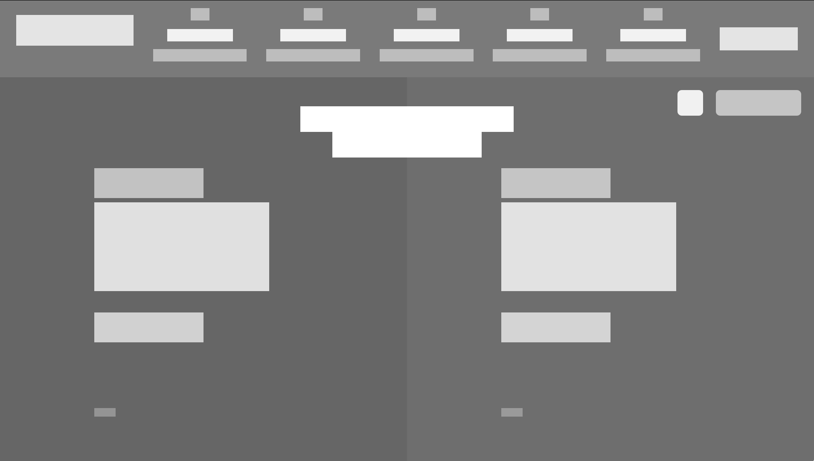

# Positioning and Floating Elements 
##  Building a heatmap of the [Smashing magazine](https://www.smashingmagazine.com/) website

### Built With
    html
    css (Flexbox and Grid)

### Check it online!
[Live preview](https://raw.githack.com/fc-anjos/design-teardown/heatmap/index.html)

### Authors:
##### Felipe dos Anjos
GitHub: [@fc-anjos](https://github.com/fc-anjos)  

##### Julia Muriuk 
Github: [@MotivateJ](https://github.com/motivatej) 

### Contributions and issues are welcome!

### License
This project is MIT licensed.
